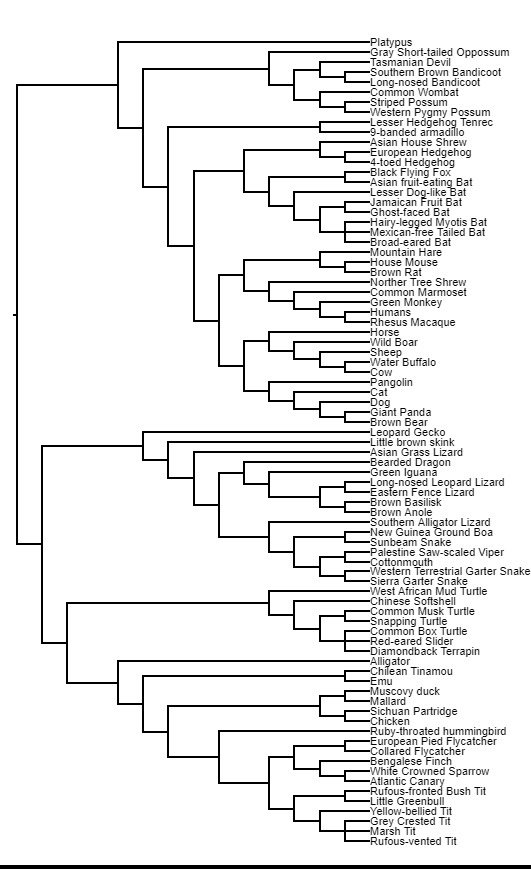
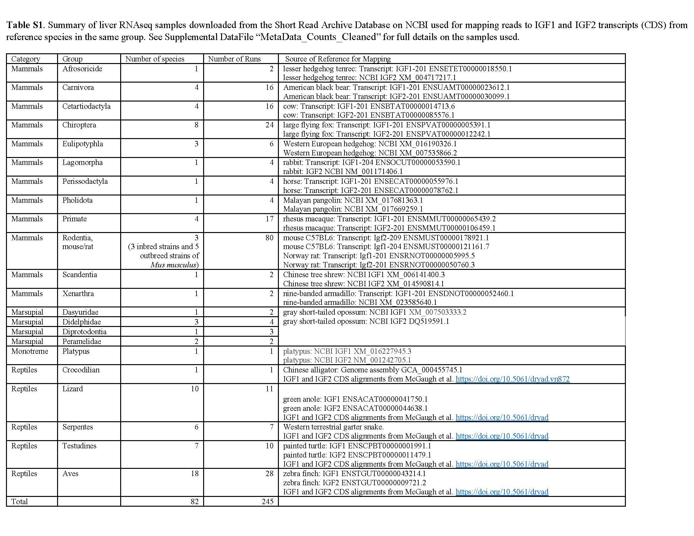
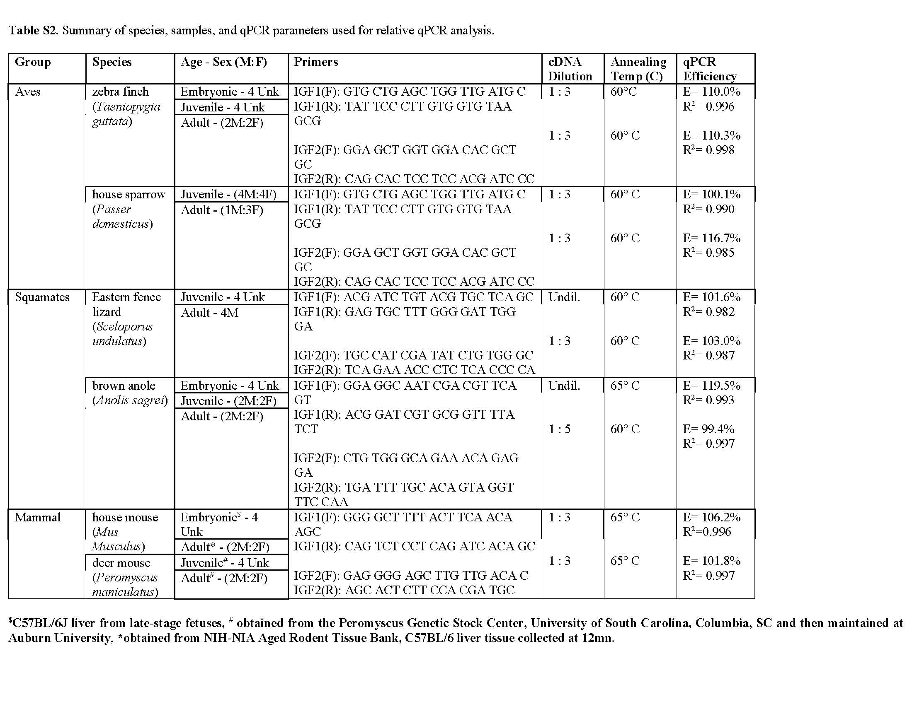

# Postnatal expression of IGF2 is the norm in amniote vertebrates
 
Abby Beatty, Alexander M Rubin, Haruka Wada, Britt Heidinger, Wendy R. Hood, and Tonia S. Schwartz 

This repository holds all supplemental files for "Postnatal expression of IGF2 is the norm in amniote vertebrates"

## Abstract: 
> "The insulin-like signaling (IIS) network plays an important role in mediating variation in growth and other life-history traits in vertebrates. Although both insulin-like growth factors (IGF) 1 and 2 are key hormones in the IIS network, research on IGF2 has been largely neglected because early biomedical research on rodents indicated a lack of IGF2 post-natal expression. Here we challenge this assumption and ask to what degree IGF2 is expressed during post-natal life in amniotes by quantifying the relative gene expression of IGF1 and IGF2 using publicly available RNAseq data for 82 amniote species and qPCR on liver cDNA at embryonic, juvenile, and adult stages for two lizard, bird, and mouse species. We found that (1) IGF2 is expressed across life stages–often at a higher relative expression than IGF1, (2) the lack of rodent post-natal IGF2 expression is due to phylogenetic placement, not inbreeding or artificial selection, and (3) adult sex-biased IGF2 expression in some species potentially regulates sex-specific differences in growth, reproduction, and senescence.  Our results demonstrate that IGF2 expression is typical for amniotes throughout life and suggests that a comprehensive understanding of the mechanisms mediating variation life-history traits will require studies that measure IGF2 as well as IGF1."

### Quick Key to File Directory: Detailed Descriptions of file use can be found below.
Analysis and File Names| File Type | Brief Description
-------------------------------------|------------------------------------ | -----------------------------------------------------
RNAseq Data Mining                    
TheBigTable-MetaData.csv             |Meta Data                            | [MetaData of RNAseq Runs Downloaded from SRA](TheBigTable-MetaData.csv)
Reference_sequences.zip              |Sequences .fasta                     | [Reference Sequences for mapping RNAseq data](Reference_sequences.zip)
RawCounts_Data.zip                   |Data                                 | [Mapping Counts_Data](RawCounts_Data.zip)
q.down_trim_map_Carnivora.sh         |Bioinformatic Code                   | [Example code for RNAseq Data Analysis](q.down_trim_map_Carnivora.sh)
MergingCounts_toMetadata_2021-06-10.R|R Code                               | [Code for Parsing Counts and Merging Metadata](MergingCounts_toMetadata_2021-06-10.R)
MetaData_Counts_Cleaned.csv          |Final Dataset                        | [Final Cleaned DataSet of RNAseq samples, counts & ratios](MetaData_Counts_Cleaned.csv)
amniota_2.tre                        |&nbsp;                               | [Dendrogram for Phylogeny](amniota_2.tre)
datafile3_plotID.csv                 |Data                                 | [Relative IGF Expression Across Amniotic Tree](datafile3_plotID.csv)
Tables_S1_S2.docx.                   |Supplemental Tables                  | [Supplemental Tables](Table_S1_S2.docx)
&nbsp; 
IGF Quantititatve Gene Expression Analysis              
Timeline_IGFs_pub.csv                |Raw Data                             | [Number of IGF Publications Over Time](Timeline_IGFs_pub.csv)
Species_Combined_edited_2.csv        |Data                                 | [qPCR Data of IGF Expression Across Species](Species_Combined_edited_2.csv)
CrossSpecGraph_Final.Rmd             |R Statistical Code                   | [Statistical Analysis/Visualization Code](CrossSpecGraph_Final.Rmd)
CrossSpecGraph_Final.html            |RMarkdown Output Files               | [HTML Markdown of Statisitical Analysis and Output](CrossSpecGraph_Final.html)
CrossSpecGraph_Final.pdf             |PDF                                  | [PDF Markdown of Statisitical Analysis and Output](CrossSpecGraph_Final.pdf)

## Project Summary: 
> This project has two distinct components. The first is a RNAseq analysis across amniotes using publicly available data. The second is a quantitative expression analysis of IGF1 and IGF2 expression in two lizards (the brown anole and eastern fence lizards), two birds (the zebra finch and house sparrow), and two mice (the house mouse and deer mouse) across developmental stages in liver tissue. Relative levels of IGF1 and IGF2 expression are examined across the animote clade in order to further detail IGF1 and IGF2 gene expression patterns across the lifespan in other species  outside  of  laboratory  rodent  models,  and  to  determine  the  overall  prevalence  of IGF2 postnatal expression across the amniote phylogeny.

## Detailed Methods: 

### Search Criteria for Publication Bias on the Study of IGF1 and IGF2 (Figure 1). 

 Results from a PubMed search using MESH terms. Solid lines represent the total number of IGF1 and IGF2 publications that were experimental in nature (MESH search queries: Insulin Like Growth Factor 2 NOT Review and Insulin Like Growth Factor 1 NOT Review). Dashed lines represent the proportion of papers at postnatal stages, excluding those performed in cancer research (MESH search query: Insulin Like Growth Factor 1 NOT Review NOT Developmental NOT Embryonic NOT Cancer and Insulin Like Growth Factor 2 NOT Review NOT Developmental NOT Embryonic NOT Cancer). Shaded curves represent the proportion of papers that were in non-biomedical model or humans (MESH search query: Insulin Like Growth Factor 2 NOT Review NOT human NOT mouse NOT Rat and Insulin Like Growth Factor 1 NOT Review NOT human NOT mouse NOT Rat). Graphical distribution of publications across years produced with R software (version 4.0.3, R Core Team) using ggplot2. Data and code provided in Supplemental GitHub.

### RNAseq Data Curration: 

To evaluate the prevalence of postnatal IGF2 expression across amniotes, we searched the NCBI Short Read Archive (SRA) database to identify RNAseq samples in amniotes that met the following search terms:  adult OR juvenile, liver, RNAseq, Illumina. For each species we selected up to four individuals that represented the control conditions if they were from an experiment. When possible, we took two male and two female samples. For mice we used eight strains of Mus musculus, including both inbred and outbred strains.  All samples used in the analysis can be found [here](TheBigTable-MetaData.csv)

SRA run files were downloaded using SRAtools [35] and cleaned using Trimmomatic [36]. [Reference Sequences](Reference_sequences.zip) and an example [code](q.down_trim_map_Carnivora.sh) for analysis are availble at the corresponding links. For each major clade, an IGF1 and IGF2 reference transcript of the coding sequence (CDS) from a focal species was downloaded from ENSEMBLE, NCBI, or DRYAD (Table S1). All the species from a clade were mapped to the same focal reference sequences (Table S1) using HiSat2 [37]. Reads uniquely mapped to the reference transcripts were counted using Samtools [38] to produce a [raw count file](RawCounts_Data.zip), and then normalized by size (kb) of the reference sequence. Runs that had low numbers of cleaned reads resulting in no mapping to either IGF1 or IGF2 were removed from the study, resulting in a [final file](MetaData_Counts_Cleaned.csv) containing 245 SRA runs representing 82 species.

For visual comparison we present the level of IGF1 and IGF2 expression as a ratio. When multiple samples were present within a species, the ratio of IGF1 to IGF2 was averaged across the individuals to obtain a single proportion for each species. Relative expression of IGF1 and IGF2 can be compared within a sample, but we do not attempt to make statistical comparisons across samples as they are from different experiments, sequencing platforms, ages, etc. The sample sizes (n = 1 to 4 within species) are powered for detection and to provide a general idea of relative expression levels between IGF1 and IGF2, but not for statistical testing of differences across species.

### Gene Expression Across Life Stages Using Quantitative PCR:

Because our focus was to survey the relative expression of IGF genes across life stages, rather than to statistically compare expression patterns between species, we utilized liver tissue from select species and ages that had been snap-frozen and stored in -80 °C from previously conducted experiments (Table S2). Quantitative gene expression analysis was completed on two birds (zebra finch [Taeniopygia guttata] and house sparrow [Passer domesticus]), two lizards (brown anole [Anolis sagrei] and Eastern fence lizard [Sceloporus undulatus]), and two rodents (house mouse [Mus musculus] and deer mouse [Peromyscus maniculatus]) across a series of life stages (embryo, juvenile, adult), using n=4 samples per group (Table S2). If these tissue samples were part of an experimental study, only control samples were used in this analysis. Total RNA was isolated from the liver samples using Illustra RNAspin Kit (Cytiva; 25-0500-70) including a DNAse digestion on a column membrane. Total RNA was quantified with the Nanodrop 2000 (ThermoFisher). Reverse transcription was conducted on 1000 ng of total RNA using qScript XLT cDNA Supermix (QuantBio; 95161-100). We quantified the expression of IGF1 and IGF2 using quantitative PCR (qPCR). For each species, a relative standard curve was created using a pool of cDNA over four 5-fold dilutions (1:1,1:5, 1:25, 1:125). Species-specific qPCR primers (Table S2) were designed to amplify a 100-150 bp product. PCR efficiency of primers were validated using the standard curve. The standard curve was run in triplicate along with the respective species samples using 3uL of cDNA at a primer specific dilution (see Table S2) in a 20 µL reaction using PerfeCTa SYBR Green SuperMix (QuantBio; 95054-050) with 0.25 µM of each primer. Reactions were run on BioRad 96FX thermal cycler using the cycle: 95 °C for 2 min, and then 40 cycles of 95 °C for 20 sec and 60 °C for 20 sec, followed by a melt curve from 60 °C to 95 °C in increments of 0.5 °C for 5 sec to test for off-target amplification. The specificity of each primer set was verified by single peaks in the melt-curves. Within a gene we calculate relative gene expression using the Ct value relative to the species-specific, gene-specific standard curve, and multiplied by the cDNA dilution factor. Expression levels can be compared between genes, and across ages within a gene and species, but not across species. Our sample sizes (n = 2 to 4 within species/age group) are powered for detection and general idea of expression level. While statistical analysis was performed to assess relative levels of IGF1 and IGF2 expression at each timepoint, samples were not statistically analyzed longitudinally due to a lack of statistical power.

CFX Maestro Software (Bio-Rad) was used to convert CQ values to copy number of IGF1 and IGF2 for each sample, adjusting expression values based on the PCR efficiency of each primer pair as determined by the standard curve. All statistical analyses were performed using copy number as a measure of gene expression, and all analyses were completed using R software (version 4.0.3, R Core Team). 

### Statistical Modeling and Data Visualization: 

The statistical analyses were performed in R (version 4.0.3) using the code file titled [Quantitative Analysis R Code](CrossSpecGraph_Final.Rmd) in an R Markdown format. The code output displays all statistical models, results, and figures produced in either [PDF](CrossSpecGraph_Final.pdf) or [HTML](CrossSpecGraph_Final.html) format. Note, you will have to download the HTML file to visualize the data output. 

Examples of required packages, statistical models, and plots used can be seen below. Note: These are generalized examples produced for ease of adaptation.  Files containing RNAseq Analysis [code](q.down_trim_map_Carnivora.sh), Parsing Counts and merging metadata [code](MergingCounts_toMetadata_2021-06-10.R), and all Statistical Analysis/Visualization [code](CrossSpecGraph_Final.Rmd) contains the specific models used for publication.

```ruby
#Required Packages
library(tidyverse)
library(viridis)
library(Rmisc)
library(ggplot2)
library(nlme)
library(arsenal)
library(janitor)
library(ggforce)
library(ggalt)
library(dplyr)
library(ggalt)
library(ggforce)

#Linear Mixed Models
#Run linear model comparing variable of interest across time, including Content as a random effect variable to account for triplicate replication in qPCR runs.
model=(lme(Dependent_Variable~Independent_Variable, data=dat, na.action=na.omit, random=~1|Content))
#Run an anova output to display F-values and P-values
anova(model)
#Run summary output to obtain Estimates, Confidence Intervals and p-values
summary(model)


#Graph patterns using ggplot2 package
plot=ggplot(data=dat, aes(x=Independent_Variable, y=Dependent_Variable, fill=GeneTarger)) + geom_violin(trim=F, position=dodge, scale="width") + 
 geom_boxplot(width=0.15, position= dodge, outlier.shape = NA, color="black") +
 geom_point(data = Independent_Variable, size =2, shape = 19, color="black", position=position_dodge(width=0.6)) +
 geom_point(position=position_jitterdodge(jitter.width = 0.05, dodge.width = 0.6), size=1, alpha=0.5, aes(group= GeneTarget),   color="white") + 
    theme_bw() +
  xlab('x_IndependentVariable_Title') +
  ylab('y_DependentVariable_Title')
```

## Supplementary Materials: 


Image of phylogenetic tree produced from the [Dendrogram for Phylogeny](amniota_2.txt). This image was used to create plot3ID CSV file and produce Figure 1 in BioRender.








